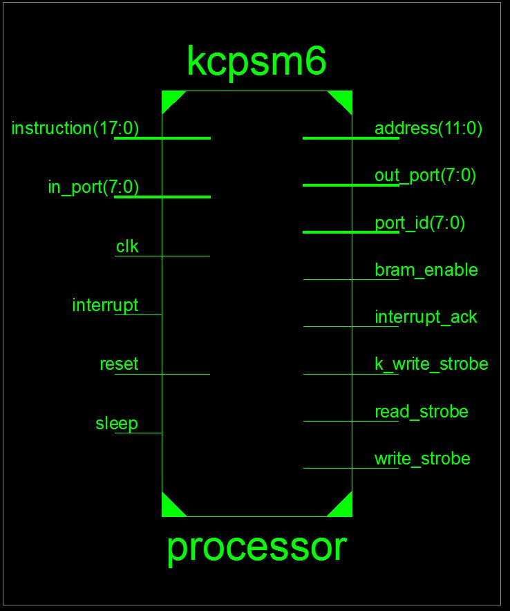
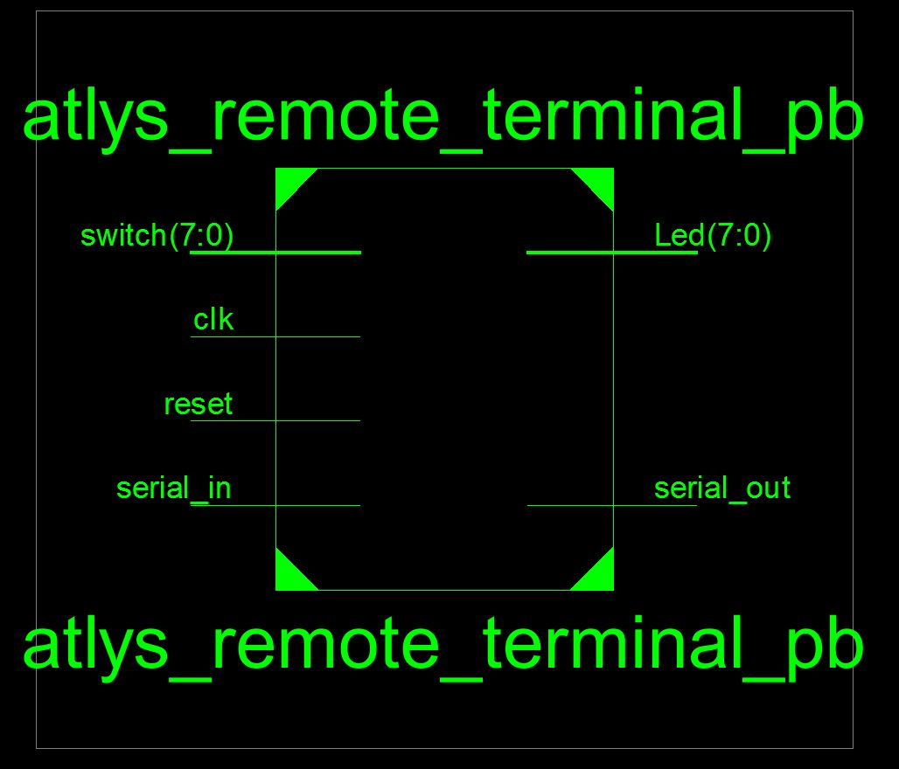
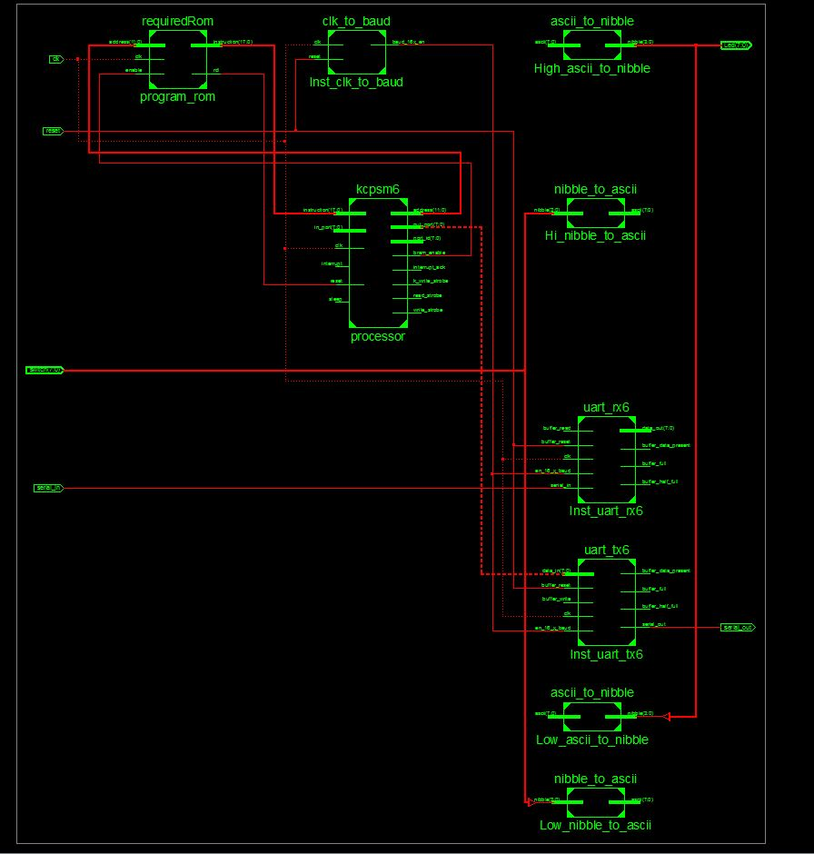

Lab4a_Picoblaze
===============

objective
---
The objective of this lab was to create a softcore processor in hardware. We did this by using a picoblaze 8 bit softcore processor. processor has the following schematic:



discussion and debugging
---
We were given the VHDL module for the processor so all we had to do was add it to our top level and wire it up. The difficult thing was creating the ROM that the processor would utilize. The tool we were given was seperate from the package the processor came in. If I developed the .ASM code in the tool, then used the package to create the ROM.vhd file, it would not work because there would be syntactic errors. I quickly found out that the instruction set in the package was concatinated when the instruction set in the tool was written out. An example of this would be the jump command. In the tool, the correct line would be
```asm
JUMP s1 
```

In the package, the correct line would be

```asm
JMP s1
```

These subtle differences were what was causing me the most trouble. Once I figured that out however, I simply had the tool create the ROM.vhd file. After that, instantiating everythin was rather strait forward. Dealing with the hardware wiring was simple because I had a lot more control over what was in hardware and what was in software. The only downfall to using the picoblaze was that it was all in .ASM. If I could have the same control over the breakout between hardware and software but utilize a HLL such as C, I would be a much happier camper. 

when I had my design working, the final top level schematic was the following:



The full schematic with everything wired up inside was as follows:



Conclusion
--- 
This lab was very cool because it bridged the gap between 382 and 383. It taught me that I can now utilize the coding skills I developed in 382 in a hardware application. That bridge is something I have been waiting for and it was well worth the wait. 
